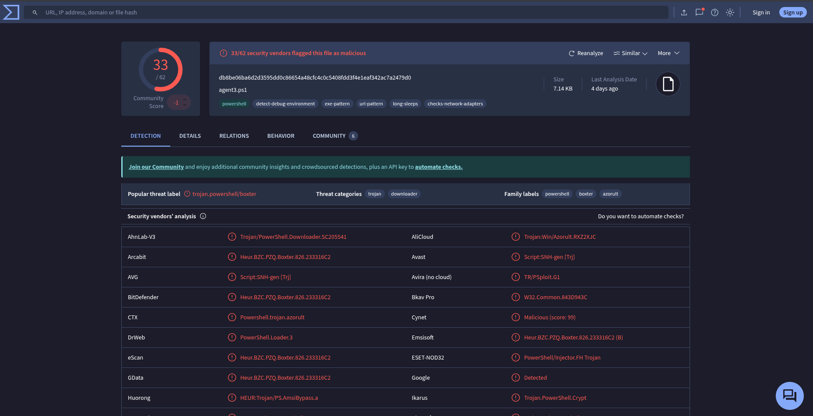
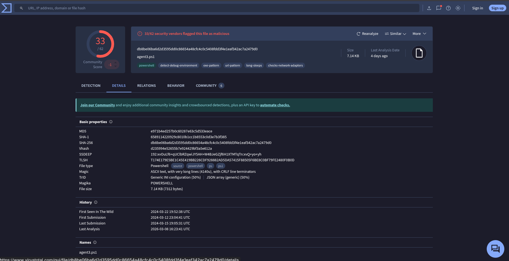

# SOC153 - Suspicious Powershell Script Executed

**Reported by:** Nizamudheen KN  
**Completed date:** 13-03-2026  

---

## Step 1: Understand

<table>
  <tr>
    <td><strong>Field</strong></td>
    <td><strong>Value</strong></td>
  </tr>
  <tr>
    <td><strong>Rule</strong></td>
    <td>SOC153 - Suspicious Powershell Script Executed</td>
  </tr>
  <tr>
    <td><strong>Hostname</strong></td>
    <td>Tony</td>
  </tr>
  <tr>
    <td><strong>IP Address</strong></td>
    <td>172.16.17.206</td>
  </tr>
  <tr>
    <td><strong>File Name</strong></td>
    <td>payload_1.ps1</td>
  </tr>
  <tr>
    <td><strong>File Path</strong></td>
    <td>C:\Users\LetsDefend\Downloads\payload_1.ps1</td>
  </tr>
  <tr>
    <td><strong>File Hash</strong></td>
    <td>db8be06ba6d2d3595dd0c86654a48cfc4c0c5408fdd3f4eleaf342ac7a2479d0</td>
  </tr>
  <tr>
    <td><strong>AV/EDR Action</strong></td>
    <td>Detected</td>
  </tr>
  <tr>
    <td><strong>Time</strong></td>
    <td>Mar 14, 2024, 05:23 PM</td>
  </tr>
</table>

## Step 1: Checking File Hash Reputation.

Virustotal:

36/62 vendors is confirmed malicious. It indicates that:
<table>
  <tr>
    <td><strong>Label</strong></td>
    <td><strong>What it means</strong></td>
  </tr>
  <tr>
    <td><strong>trojan.powershell/boxter</strong></td>
    <td>PowerShell Trojan — malicious script</td>
  </tr>
  <tr>
    <td><strong>Trojan/PowerShell.Downloader</strong></td>
    <td>It downloads more malware onto the system</td>
  </tr>
  <tr>
    <td><strong>PowerShell/Injector.FH Trojan</strong></td>
    <td>It injects code into other processes</td>
  </tr>
  <tr>
    <td><strong>AMSI Bypass (Huorong)</strong></td>
    <td>It tries to bypass Windows antivirus!</td>
  </tr>
  <tr>
    <td><strong>Downloader category</strong></td>
    <td>Stage 1 malware — pulls more payloads</td>
  </tr>
</table>
