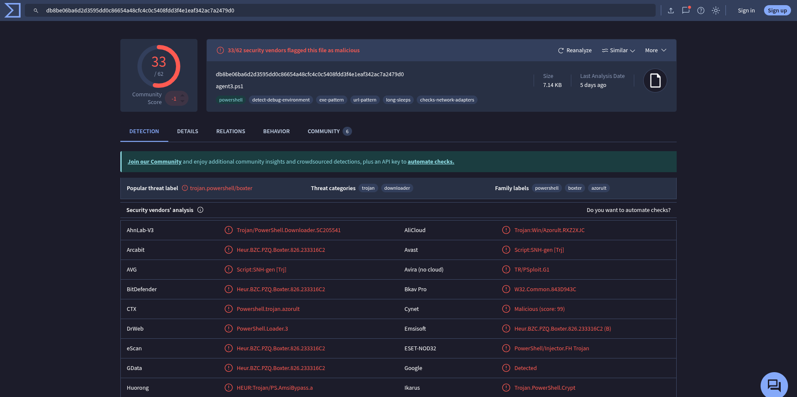
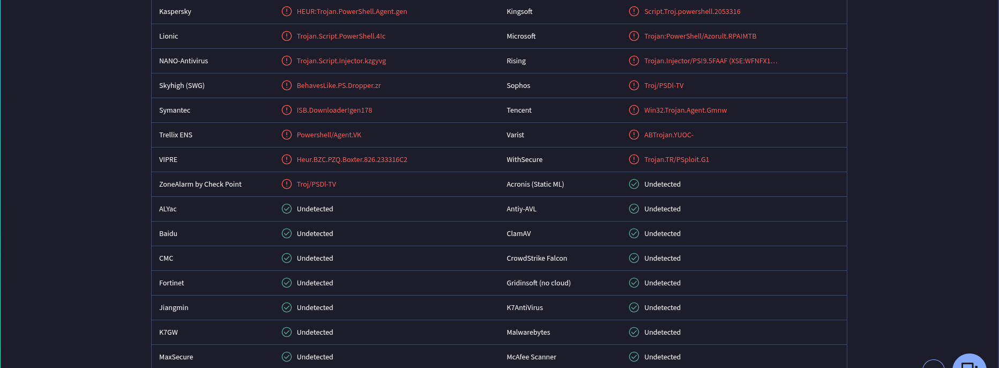
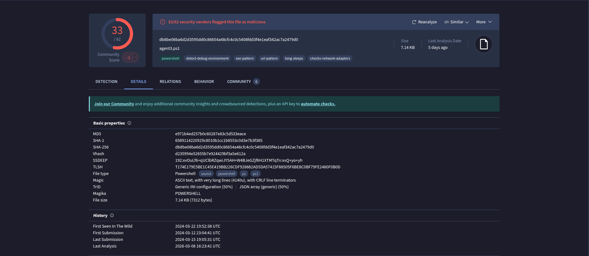
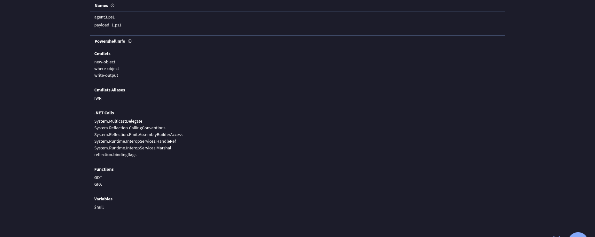
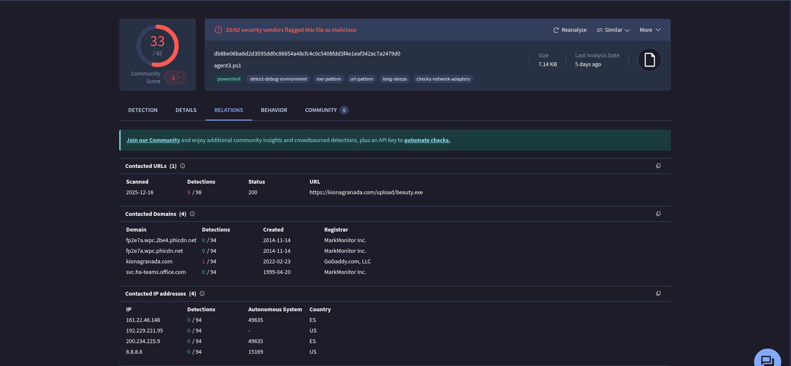
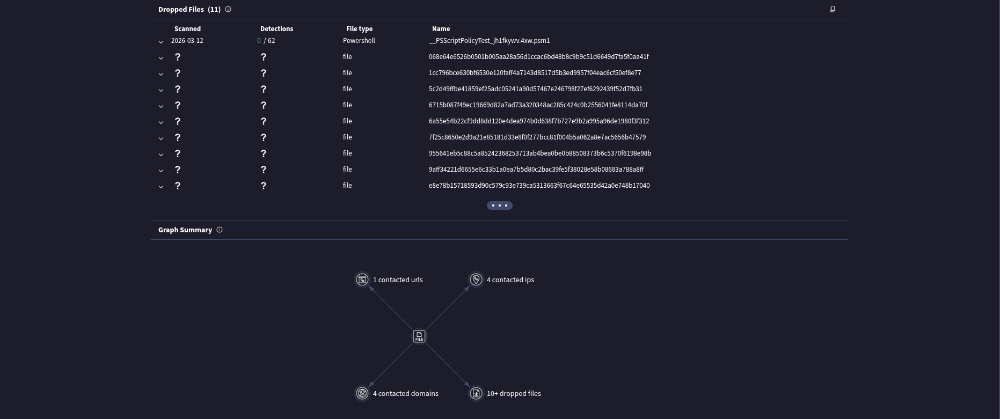

# SOC153 - Suspicious Powershell Script Executed

**Reported by:** Nizamudheen KN  
**Completed date:** 13-03-2026  

---

## Step 1: Understand

<table>
  <tr>
    <td><strong>Field</strong></td>
    <td><strong>Value</strong></td>
  </tr>
  <tr>
    <td><strong>Rule</strong></td>
    <td>SOC153 - Suspicious Powershell Script Executed</td>
  </tr>
  <tr>
    <td><strong>Hostname</strong></td>
    <td>Tony</td>
  </tr>
  <tr>
    <td><strong>IP Address</strong></td>
    <td>172.16.17.206</td>
  </tr>
  <tr>
    <td><strong>File Name</strong></td>
    <td>payload_1.ps1</td>
  </tr>
  <tr>
    <td><strong>File Path</strong></td>
    <td>C:\Users\LetsDefend\Downloads\payload_1.ps1</td>
  </tr>
  <tr>
    <td><strong>File Hash</strong></td>
    <td>db8be06ba6d2d3595dd0c86654a48cfc4c0c5408fdd3f4eleaf342ac7a2479d0</td>
  </tr>
  <tr>
    <td><strong>AV/EDR Action</strong></td>
    <td>Detected</td>
  </tr>
  <tr>
    <td><strong>Time</strong></td>
    <td>Mar 14, 2024, 05:23 PM</td>
  </tr>
</table>

Here what we are investigating is that a system of user named Tony's computer detected suspuicious power shell script getting executed. The file name is `payload_1.ps1`. But here the term payload is a term of the program used by attackers inorder to exploit a vulnerability. So the file name itself is very suspicious and along with that the file path of `payload_1.ps1` is `C:\Users\LetsDefend\Downloads\payload_1.ps1`. The only way the file gets in Downloads directory is by the user downloading it either intentionally or unintentionally by phishing links or getting downloaded from any malicious sites.

- Intentionally means it can be an insider threat (employee doing bad things).
- Unintentionally means victim like employee got tricked.

The AV/EDR detected the but its just detefction not blocked that means its still infected. This is critical the threat is potentially still running on Tony's machine.

## Check File Hash Reputation.

**Hash**: db8be06ba6d2d3595dd0c86654a48cfc4c0c5408fdd3f4eleaf342ac7a2479d0

Here are the results of the hash reputatuion from virus total:

